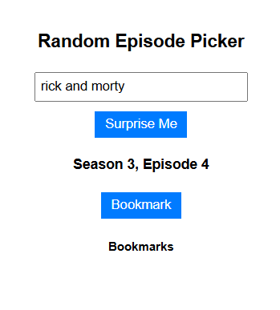
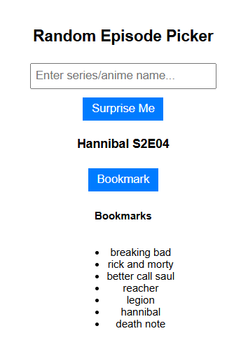

# 🌟 Randex - Random Episode Picker 🎲🎥

Randex is a Chrome extension that picks a random episode for your favorite web series or anime. Whether you're unsure what to watch or just want a surprise, Randex will help you decide with a single click!


## 🚀 Features
- **Generate Random Episodes**: Enter a series name, and Randex will fetch a random episode for you.
- **Surprise Me!**: If you have bookmarked series, this button selects a random episode from one of them.
- **Bookmark Your Favorites**: Save your frequently watched series for quick access.
- **Minimalistic & Aesthetic UI**: Designed to be simple, clean, and user-friendly.

---

## 📥 Installation Guide

### 🔹 Load the Extension in Chrome
1. **Clone or Download** this repository:
   ```sh
   git clone https://github.com/<your-username>/randex.git
   ```
2. Open Google Chrome and navigate to:
   ```sh
   chrome://extensions/
   ```
3. Enable **Developer Mode** (toggle on the top-right).
4. Click **Load unpacked** and select the downloaded `randex` folder.
5. RandEx is now installed and ready to use! 🎉

## 🎮 How to Use
1. Click the RandEx icon in the Chrome toolbar.
2. **Generate Random Episode**:
   - Enter a web series or anime name in the input field and click "Generate".
   
    

3. **Surprise Me! Feature**:
   - If you have bookmarked series/anime, leave the input field empty and click "Surprise Me!" to get a random episode from your saved list.
   - If no bookmarks are available, it will pick a random famous web series/anime.


    

4. **Bookmarking**:
   - Click "Bookmark" to save the series for later.
   - Select any bookmarked series from the list and generate a random episode.

## ⚙️ Technologies Used

- **JavaScript (ES6+)**: Core logic for API requests and UI interactions.
- **HTML & CSS**: Simple yet modern design for the popup UI.
- **Chrome Storage API**: Stores bookmarks persistently.
- **OpenRouter API (Claude AI)**: Fetches random episodes dynamically.

## 📌 Roadmap & Future Features

✅ Basic functionality with random episode generation  
✅ Persistent bookmarks stored in Chrome  
⬜ UI enhancements with animations  
⬜ Dark mode support  
⬜ Additional AI models for more accurate episode selection  
⬜ Improvement in prompt generation and consistent responses in accurate format  


## 🏗️ Contributing

We welcome contributions! If you’d like to add features, follow these steps:

1. Fork this repository.
2. Create a new branch:
   ```sh
   git checkout -b feature-new-feature
   ```
3. Make your changes and commit:
   ```sh
   git commit -m "Added new feature"
   ```
4. Push to GitHub:
   ```sh
   git push origin feature-new-feature
   ```
5. Open a **Pull Request** for review.

## 🔐 License

This project is open-source under the **MIT License**. Feel free to modify and distribute.

